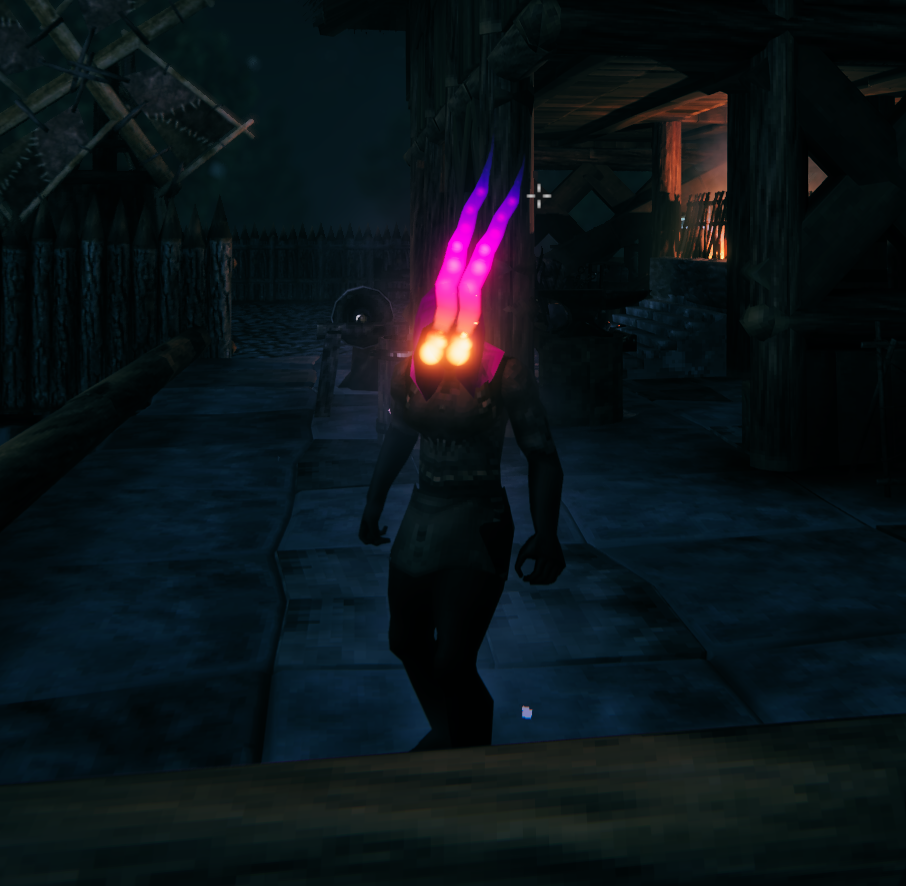
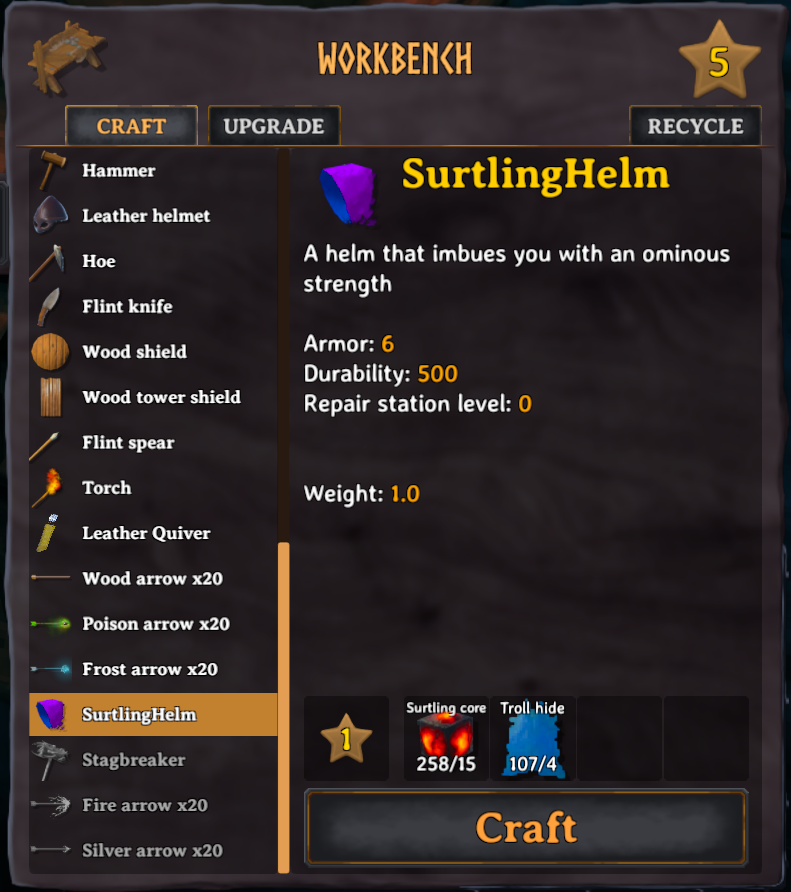
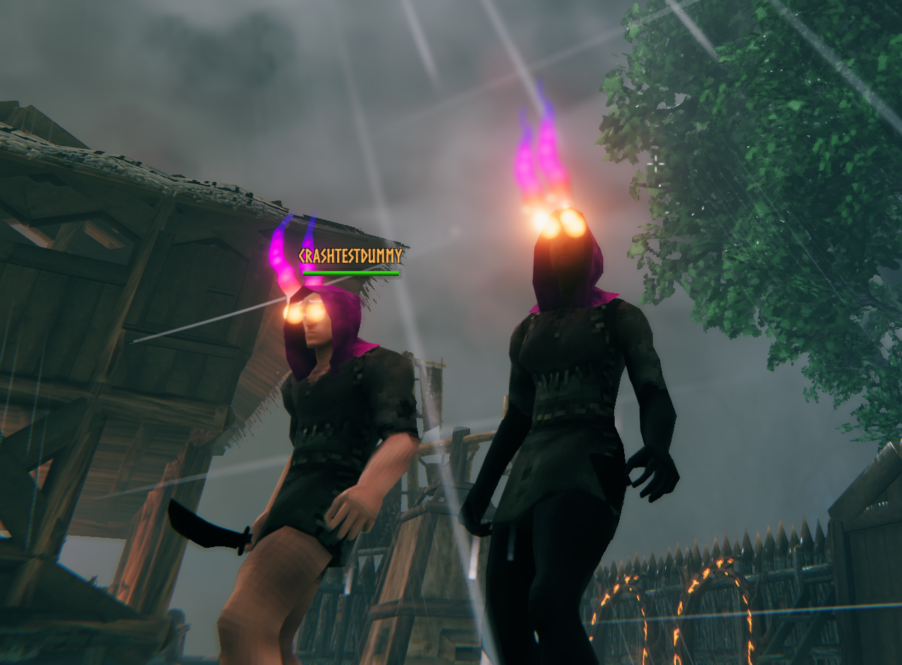
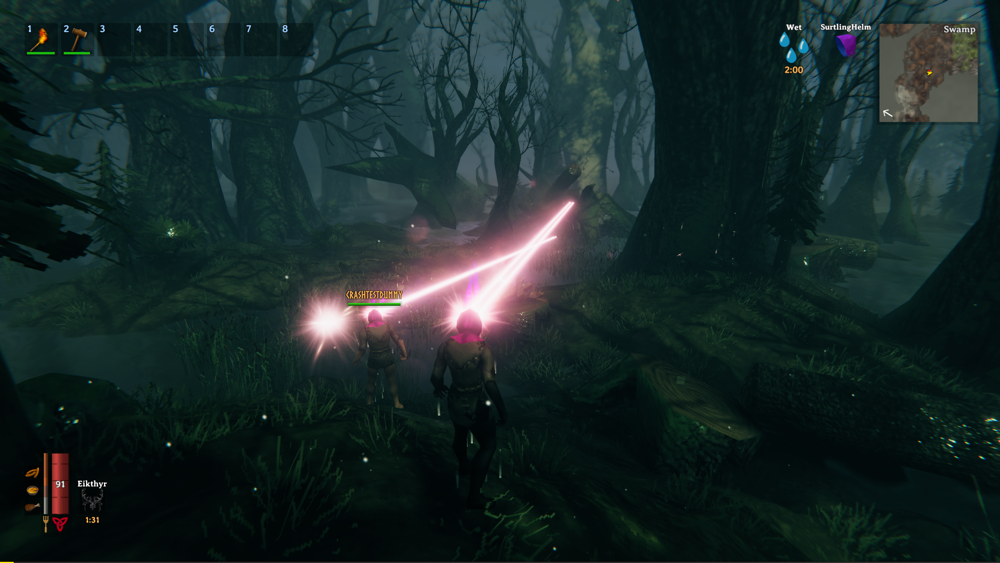

The Viking afterlife is great, but chopping down one solitary tree at a time while dodging constant Greydwarf ambushes can really get exhausting. The Surtling Helm is a new piece of equipment that throws away all that silly balance and pacing, cranks everything up to 13, and lets you rain nuclear death across the land.

## Guide

To get your helmet, first:

* [Install BepInEx](https://valheim.thunderstore.io/package/denikson/BepInExPack_Valheim/)
* [Install the HookGen patcher](https://valheim.thunderstore.io/package/ValheimModding/HookGenPatcher/)
* [Install ValheimLib](https://valheim.thunderstore.io/package/ValheimModding/ValheimLib/)
* Copy SurtlingHelm.dll into your BepInEx/plugins folder
* Find a basic workbench and craft your purple hood of imminent death! (for a one-time fee of Surtling Cores, Troll Hide, Linen Thread, and Surtling Trophies)
* Once equipped, press the fire key (default G) to shoot lasers (consumes 1 Surtling Core for every 5 seconds fired by default)

## Config

The config file lives at BepInEx/config/SurthlingHelm.cfg. You can use it to configure the following features:

* Damage amounts for several types
* Whether the helm uses Surtling Cores to fire lasers (or should just fire for free)
* The cost to produce it (if you set all costs to 0, it will cost 1 wood)
* The level of workbench required to make it

## Changeset

### 0.1.2
* Added ability to toggle eye fire trail via config
* Added ability to toggle laser sound effect via config
* Made ray cast start at a safer distance dependent on player position relative to camera

### 0.1.1
* Added ability to toggle consumption of Surtling Cores in order to power the laser (default grants 5 seconds of laser per core consumed)
* Changed sound effect to be less obnoxious
* Added workbench level setting for how difficult it is to craft
* Added Linen Thread and Surtling Trophy requirements for crafting
* Added ability to set required items to 0 for crafting in order to remove them

### 0.1.0
* Initial release

# Check out these features!

## Stylish

Glow with a palpable force as you wander the countryside!

## Powerful

"Like if Cyclops was an Amish raver" - Tona

## Craftable

Configure how much it costs to make your own!

## Multiplayer-Ready

Grab a friend (or 9) and lay waste to the countryside together!

## Credits

* This repo began as a fork of the excellent [ValheimModStub](https://github.com/sirskunkalot/ValheimModStub) repo which is a great template for Valheim mods
* It's also built using [ValheimLib](https://github.com/Valheim-Modding/ValheimLib) which greatly simplifies adding new items

## Make Your Own

Check out the [Valheim modding wiki](https://github.com/Valheim-Modding/Wiki/wiki) to learn more, including how to [add your own items!](https://github.com/Valheim-Modding/Wiki/wiki/Custom-Item-and-Recipe-Creation)
